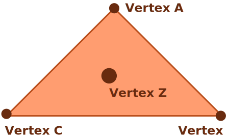

# Barycentric Coordinates

In geometry, a barycentric coordinate system is a coordinate system in which the location of a point is specified by reference to a simplex (a triangle for points in a plane, a tetrahedron for points in three-dimensional space, etc.). ... Every point has barycentric coordinates, and their sum is not zero. [Source](https://en.wikipedia.org/wiki/Barycentric_coordinate_system)

# Meaining For Our Game

This coordinate system enables us to verify a vertex in any figure since any figure can be represented as the composition of one or more triangles.

<div style="text-align:center">
    
</div>
<br/>
<br/>
The coordinate system allows us to infer whether a vertex is inside, outside or edging the figure.
<br/>
<br/>
<div style="text-align:center">
    
</div>

The retrival of the coordinates given a cartesian context can be achived in the following way.

<div style="text-align:center">
    
</div>

```python
from decimal import Decimal

x = Decimal(3) // Vertex Z X
y = Decimal(0) // Vertex Z Y

x1 = Decimal(0) // Triangle Vertex A X
y1 = Decimal(0) // Triangle Vertex A X

x2 = Decimal(1) // Triangle Vertex B X
y2 = Decimal(3) // Triangle Vertex B X

x3 = Decimal(3) // Triangle Vertex C X
y3 = Decimal(0) // Triangle Vertex C X


detT = ((y2-y3)*(x1-x3)) + ((x3-x2)*(y1-y3))

print(detT)

l1 = (((y2-y3)*(x-x3))+((x3-x2)*(y-y3))) / detT

l2 = (((y3-y1)*(x-x3))+((x1-x3)*(y-y3))) / detT

l3 = 1 - l1 - l2

print(f'a: {l1}\nb: {l2}\nc: {l3}')
```

# Proving the game

The game dynamic consists in finding whether any figure in a delimited space is overlaping any other, if this premise returns false then the game is solved, on the other hand, if the game detects an overlap then the game is not solved. This could be approached by the following.

<div style="text-align:center">
    
</div>

Using the barycentric coordinate system, this will determine if any vertex of any foreign figure is inside, outside or edging the main figure.

# Edge Cases & Caveats

There is one posible edge case that would need to be addressed in this system. The whole sustantial idea of the tangram game is to prove if any other figures in a delimited area are overlaping each other, if this premise returns true then the game is not finished else it is.

<div style="text-align:center">
    
</div>

If this case was presented, the system would evaluate that no figure is overlaping since no vertex is inside any other figure, but this is incorrect, Figure A and Figure B are overlaping.